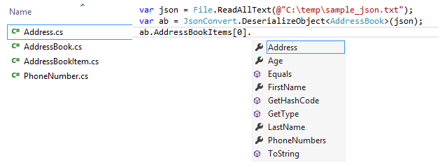

## Project Description  ##
 This application generates C# classes from a sample JSON text, so you can use strongly typed programming with JSON.  
 It currently supports typed arrays, typed objects, integers, floats, booleans, strings and nullable types.  

 Note: dictionaries (associative arrays) are not currently supported.

Last edited May 9, 2014 at 4:07 AM by [antiufo](https://github.com/antiufo), version 14
